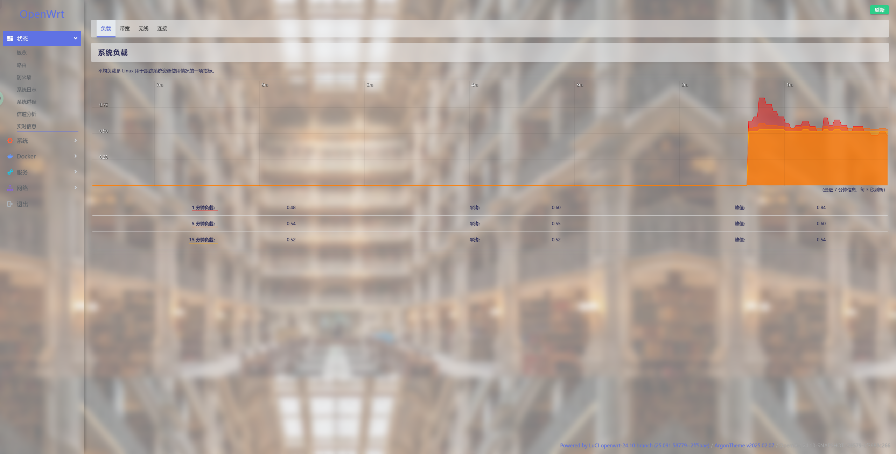

# luci-theme-argon
> forked from jerrykuku/luci-theme-argon
* 跟原版相比：
    1. 将管理界面的白色背景改为图片，与登录页背景一致
    2. 调整部分不透明内容或按钮显示区域大小，使其在非白色背景下更和谐
* 仓库引用：详情看`https://github.com/sunowsir/openwrt_patch`
* 截图：
    
    
    
    
    
